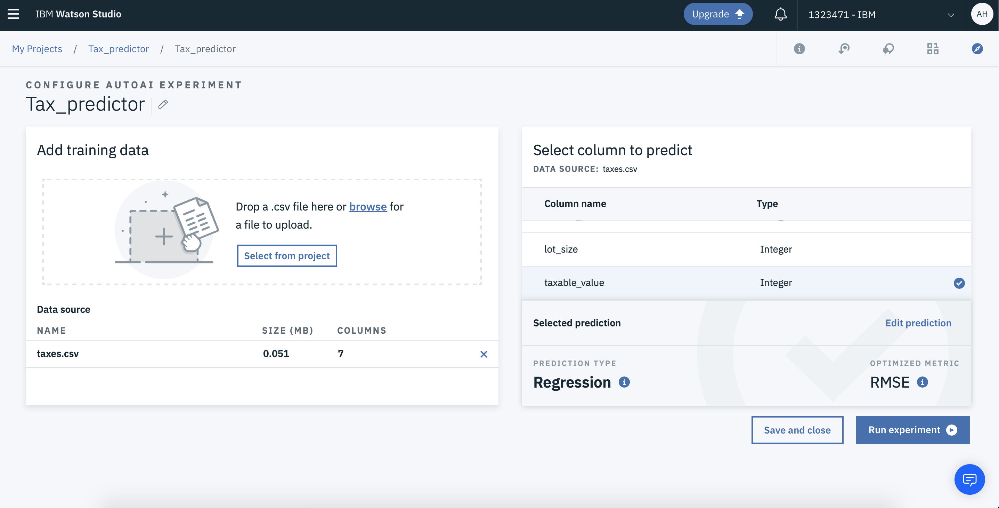
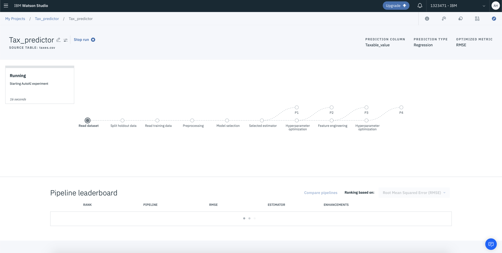
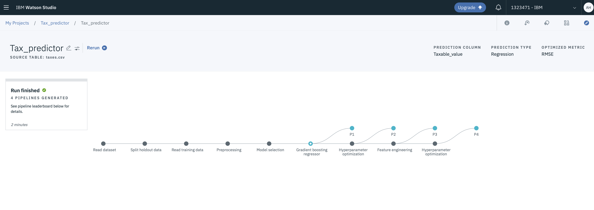
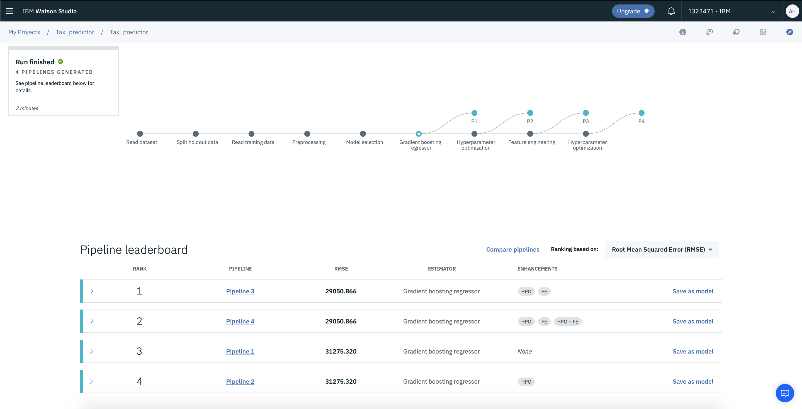
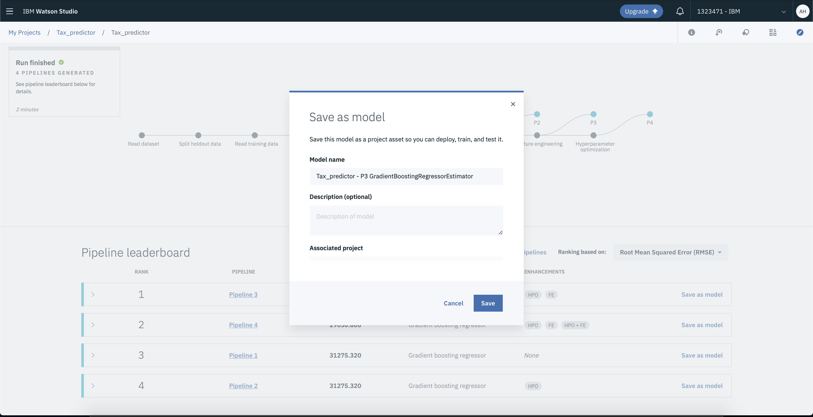
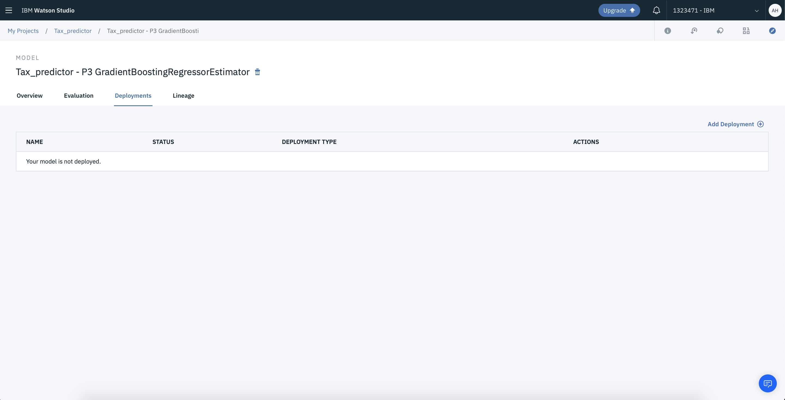
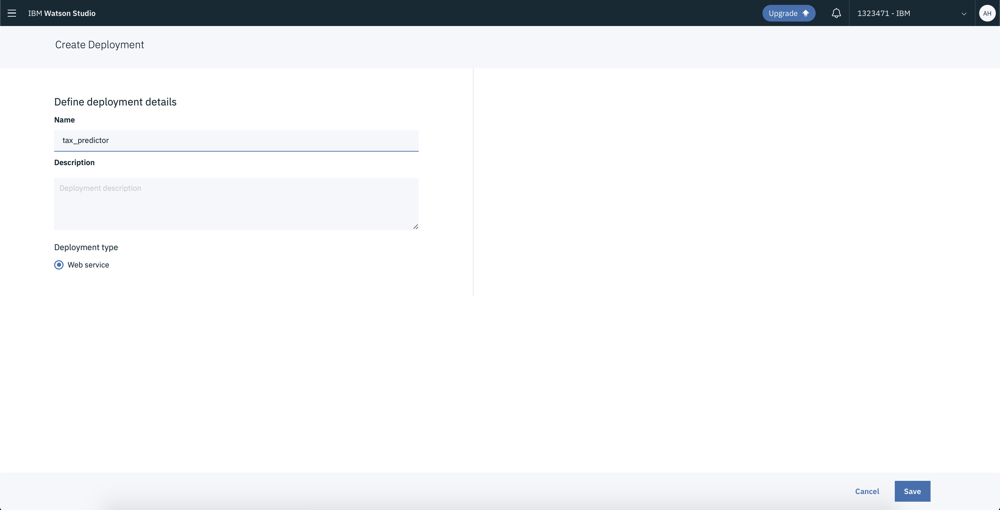
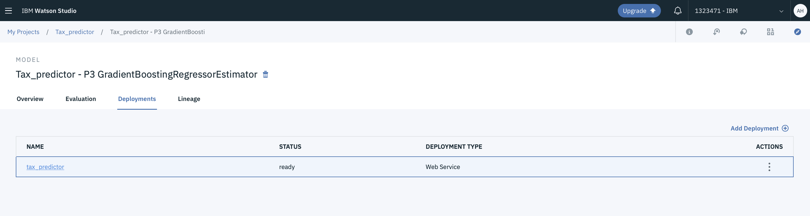
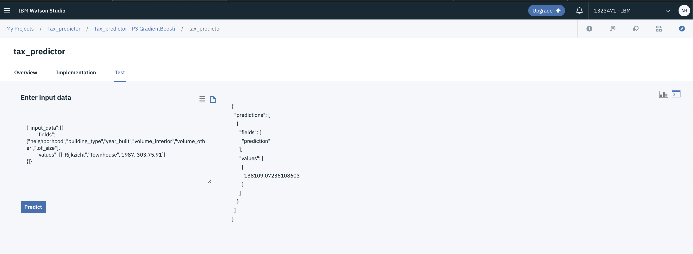

# Tax-Prediction-using-AutoAI
This tutorial guides you through training a model to predict taxes for different houses based on locations, house types, etc. It uses [Cognos Dashboards](https://www.ibm.com/ae-en/products/cognos-analytics) and [AutoAI](https://www.ibm.com/cloud/watson-studio/autoai) in IBM [Watson Studio](https://www.ibm.com/cloud/watson-studio), which makes it possible for you to:

- Automate your AI lifecycle management
- Enable one-click deployment with Watson Machine Learning
- Build better models faster and go live using the skill sets you have
- Scale experimentation and deployment processes
- Monitor and de-bias AI outcomes with [Watson OpenScale](https://www.ibm.com/cloud/watson-openscale/)
- Increase trust and transparency in AI/ML development

[AutoAI](https://www.ibm.com/cloud/watson-studio/autoai) is a great way to get started even if you have no idea which model to use. All you do is give it data!!

## Prerequisites

1. Sign up for an [IBM Cloud account](https://cloud.ibm.com/registration/).

## Estimated time

This tutorial takes about 20 minutes to complete if you already have an IBM cloud account set up.

## Steps
 
1. Create an instance of the Watson Studio
   - Go to the [Watson Studio](https://cloud.ibm.com/catalog/services/watson-studio?bss_account=e366b6e4fb004c5eaccfbe7042b670a4) page in the IBM Cloud Catalog.
   - Click **Create**.
  
 
 
    
   - Click **Create a Project** > Standard
   
   - Add Project name


- Add the [dataset](https://github.com/Abeer-Haroon/Tax-Prediction-using-AutoAI/blob/master/taxes.csv) into the project.


- Add to Project > Dasboard > Create by uploading the file: [taxes.json](https://github.com/Abeer-Haroon/Tax-Prediction-using-AutoAI/blob/master/taxes.json)


These visualizations are created to get insights into the data.

Next, we begin by making our predictive model.
 
 - Add to Project > AutoAI Experiment
 
 AutoAI automates:
- Data preparation
- Model development
- Feature engineering
- Hyper parameter optimization


- Give it a name and click **Create**

- Select from Project > taxes.csv

- Select the column to predict: taxable_value

Selected Prediction by **AutoAI**



AutoAI Experiment in Progress



Run Finished



**Pipeline Leaderboard**



- Watch and compare the top performing models on the leaderboard. Save the pipeline with rank 1, as a model.



- Go to deployments tab > Create a new deployment



- Name it



- Once the status of the deployment is ready, click on it.



- Click on the Test Tab to test your model with the following input.

``` 
  {"input_data":[{
        "fields": ["neighborhood","building_type","year_built","volume_interior","volume_other","lot_size"],
        "values": [["Rijkzicht","Townhouse", 1987, 303,75,91]]
}]}

```

- Click Predict.




